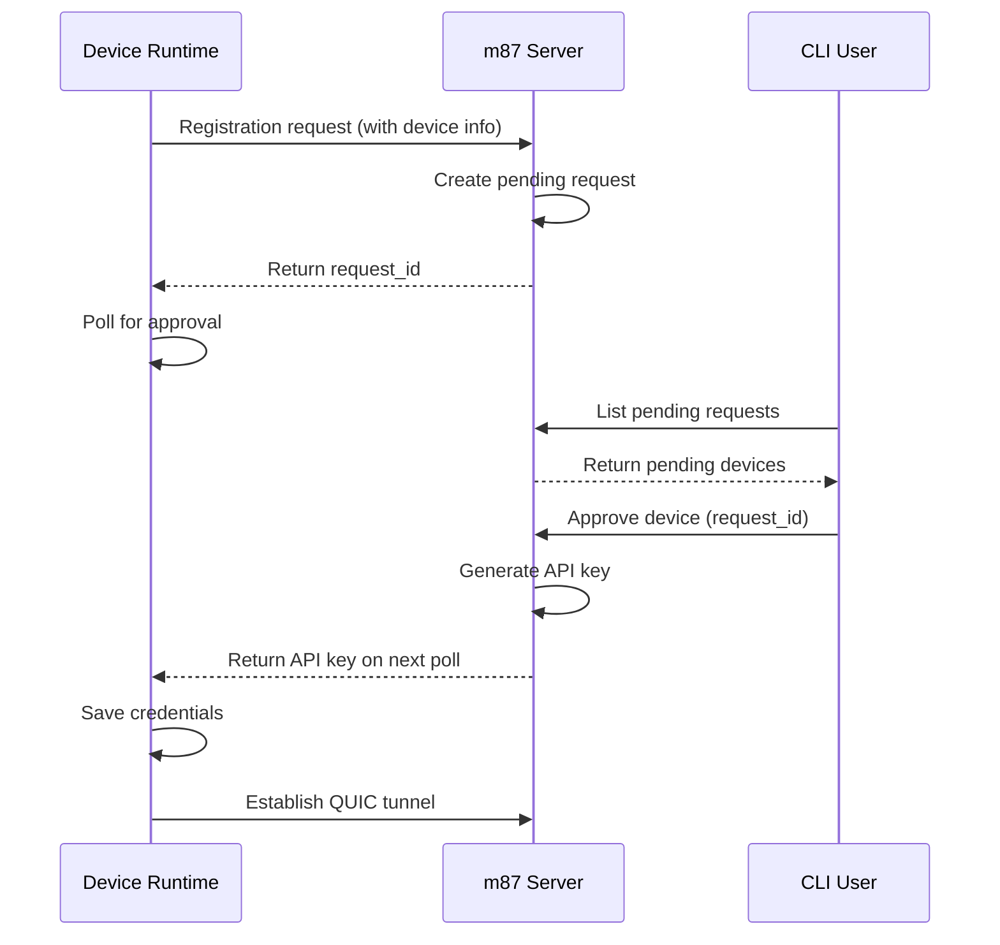
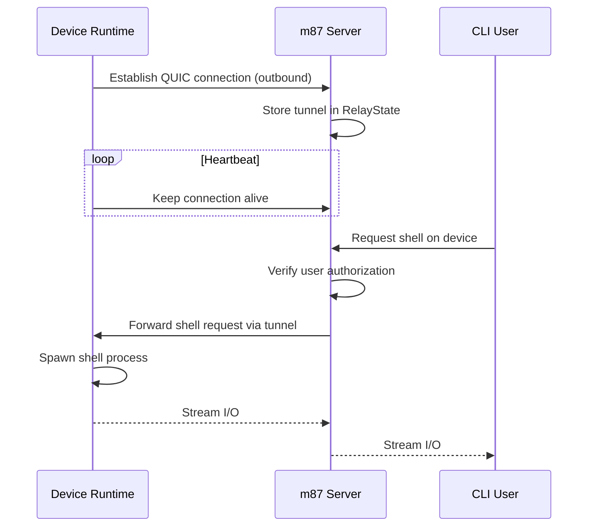

The m87 system consists of three main components that work together to provide secure, outbound-only access to distributed devices.

## Core components

### m87 CLI (client)

The command-line interface you run on your workstation to interact with remote devices.

**Primary functions:**
- Device management (list, approve, reject)
- Remote access (shell, exec, port forwarding)
- File operations (copy, sync)
- Container management (docker commands)
- Authentication (OAuth2 device flow)

**Implementation:**
- Written in Rust for performance and reliability
- Runs on Linux and macOS
- Located in `m87-client` package
- Licensed under Apache-2.0

<Info>
The CLI stores credentials in `~/.config/m87/credentials.json` with `0o600` permissions for security.
</Info>

### m87 runtime (device agent)

A long-running process that runs on edge devices to enable remote management.

**Primary functions:**
- Maintains outbound connection to m87 server
- Executes commands received from authorized users
- Streams logs and metrics
- Handles file transfer operations
- Manages container deployments

**Implementation:**
- Written in Rust (shares codebase with CLI)
- Linux-only (supports amd64 and arm64)
- Can run as systemd service for production use
- Located in `m87-client` package (runtime feature)

<Tip>
The runtime runs as your user (not root) and can be managed with:
```bash
m87 runtime enable --now  # Enable and start service
m87 runtime status        # Check service status
```
</Tip>

### m87 server (relay)

The backend service that connects CLI users to device runtimes.

**Primary functions:**
- Device registration and approval workflow
- Authentication and authorization
- QUIC tunnel relay between users and devices
- WebTransport support for browser-based access
- REST API for device management

**Implementation:**
- Written in Rust
- Uses MongoDB for persistence
- QUIC-based tunneling (via Quinn library)
- Located in `m87-server` package
- Licensed under AGPL-3.0-or-later

**Ports:**
- `443` (or 8084): Runtime connections and tunnel traffic (TLS/QUIC)
- `8085`: REST API

<Note>
The server can be self-hosted for on-premise deployments or used via the hosted make87 platform.
</Note>

## Communication flow

### Initial device registration



<Accordion title="View detailed registration flow">
1. **Device initiates registration**: Runtime calls `m87 runtime run --email user@example.com`
2. **Server creates request**: Stores device info, generates unique `request_id`
3. **User reviews request**: Runs `m87 devices list` to see pending devices
4. **User approves device**: Runs `m87 devices approve <request-id>`
5. **Server issues credentials**: Generates API key for device
6. **Device polls for approval**: Receives API key within timeout
7. **Runtime saves credentials**: Stores in `~/.config/m87/credentials.json`
8. **Persistent connection**: Device establishes QUIC tunnel to server
</Accordion>

### Runtime tunnel connection

Once registered, devices maintain a persistent outbound connection:



<Warning>
All connections are outbound from the device. No inbound ports need to be opened on the device network.
</Warning>

### Command execution flow

When you run commands like `m87 <device> shell`:

1. **CLI authenticates**: Gets OAuth2 token (refreshes if expired)
2. **CLI requests action**: Sends authenticated request to server API
3. **Server authorizes**: Verifies user has access to device (scope-based)
4. **Server relays**: Forwards request through device's QUIC tunnel
5. **Runtime executes**: Spawns process and captures I/O
6. **Bidirectional stream**: I/O flows through server back to CLI

## Shared components

### m87-shared

A Rust crate containing types and utilities used by both client and server:

- Device system information structures
- Protocol message definitions
- Common serialization formats
- Shared utility functions

<Info>
This is an internal crate, not published separately. It ensures consistency between client and server implementations.
</Info>

## Technology stack

### Core technologies

- **Rust 1.85+**: All components written in Rust for safety and performance
- **QUIC (Quinn)**: Low-latency, multiplexed tunneling protocol
- **Tokio**: Async runtime for handling concurrent connections
- **TLS/Rustls**: Secure communication without OpenSSL dependencies
- **MongoDB**: Server-side persistence for devices, users, and deployments

### Key libraries

| Library | Purpose |
|---------|--------|
| `quinn` | QUIC protocol implementation |
| `tokio-rustls` | Async TLS connections |
| `openidconnect` | OAuth2 device flow authentication |
| `jsonwebtoken` | JWT validation for API requests |
| `reqwest` | HTTP client for API calls |
| `serde` | Serialization/deserialization |

## Deployment patterns

### Hosted platform

Use the managed make87 platform (default):

```bash
# CLI automatically connects to platform
m87 login

# Runtime registers with platform
m87 runtime run --email you@example.com
```

### Self-hosted

Deploy your own m87 server:

```bash
# Start server with Docker Compose
cd m87-server
docker compose up -d

# Configure CLI to use your server
export M87_API_URL=https://your-server.com
m87 login
```

<Accordion title="Self-hosting requirements">
- **MongoDB**: For storing devices, users, and state
- **TLS certificate**: For port 443 (runtime/tunnel traffic)
- **OAuth provider**: Auth0 or compatible OAuth2/OIDC provider
- **Environment variables**: See `m87-server/docker-compose.yml`

**Minimum resources:**
- 1 CPU core
- 512MB RAM
- 10GB storage
</Accordion>

## Performance characteristics

### Connection overhead

- **Initial tunnel setup**: ~100-200ms (QUIC handshake)
- **Command latency**: ~5-20ms after tunnel established
- **Reconnection**: Automatic with exponential backoff

### Scalability

- **Single server**: 1000+ concurrent device connections
- **Horizontal scaling**: Multiple servers with load balancing
- **Connection multiplexing**: Multiple streams per QUIC connection

### Resource usage

**Runtime (per device):**
- Idle: ~5-10MB RAM
- Active command: +10-50MB depending on operation
- CPU: Minimal when idle, scales with workload

**Server (per 1000 devices):**
- RAM: ~500MB-1GB
- CPU: 1-2 cores
- Network: ~100KB/s idle, scales with active traffic

<Note>
The QUIC protocol provides efficient multiplexing, allowing multiple operations simultaneously without additional overhead.
</Note>

## Build configuration

The codebase uses Cargo workspace with optimized release profiles:

```toml
[profile.release]
opt-level = 3              # Maximum optimization
lto = "fat"                # Full link-time optimization
codegen-units = 1          # Better optimization
strip = true               # Strip debug symbols
```

This produces minimal, performant binaries suitable for resource-constrained edge devices.
