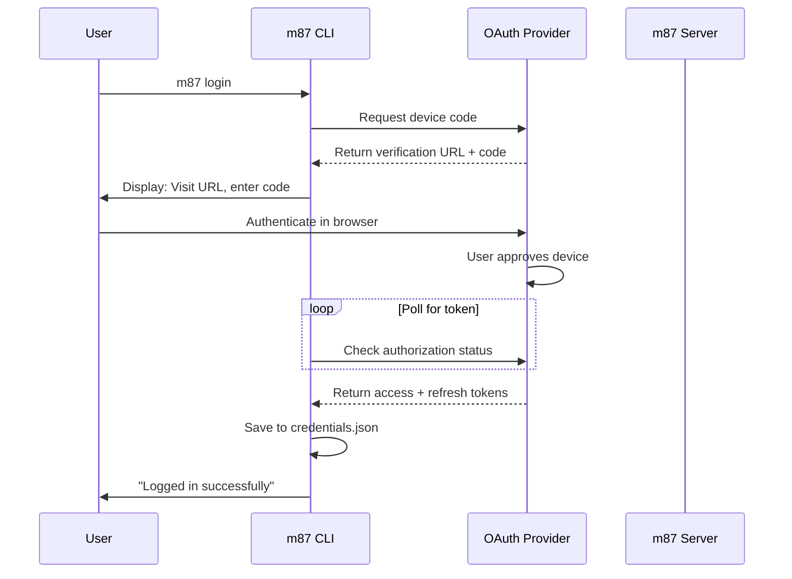
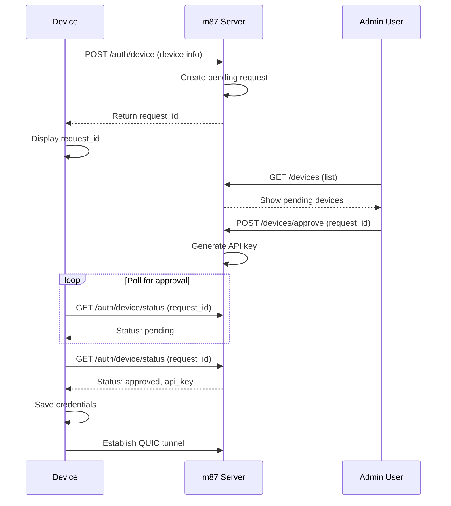
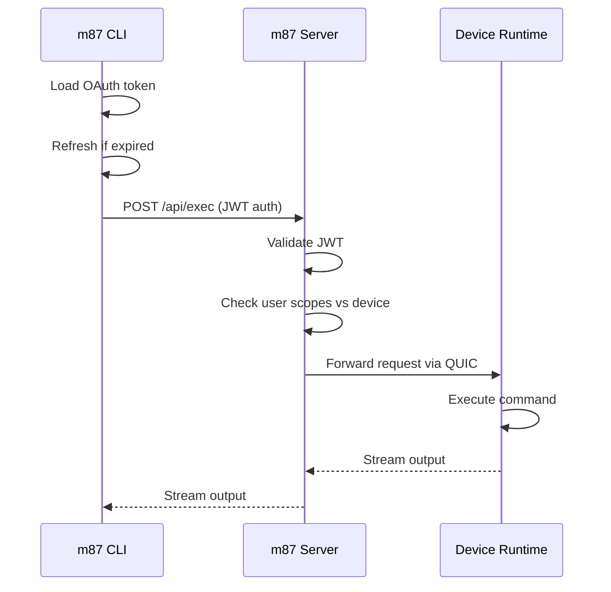

The m87 platform uses different authentication mechanisms for CLI users and devices, with a scope-based authorization model for access control.

## User authentication (CLI)

### OAuth2 device flow

CLI users authenticate using the OAuth2 device authorization flow, which is designed for devices without browsers:

```bash
m87 login
```

**What happens:**

1. CLI requests device authorization from OAuth provider
2. Provider returns verification URL and user code
3. CLI displays: "Visit https://auth.make87.com/activate and enter code: ABCD-EFGH"
4. User opens browser and completes authentication
5. CLI polls token endpoint until user approves
6. CLI receives access token and refresh token
7. Tokens stored in `~/.config/m87/credentials.json`

<Info>
The device flow is perfect for CLIs because it doesn't require embedding a web server or handling redirects. Users authenticate in their regular browser with full security features.
</Info>

### Token lifecycle

**Token structure:**

```rust
pub struct OAuth2Token {
    pub access_token: String,       // Short-lived (typically 1 hour)
    pub refresh_token: Option<String>, // Long-lived (days/weeks)
    pub expires_at: u64,            // Unix timestamp
}
```

**Automatic refresh:**

The CLI automatically refreshes expired tokens:

```rust
impl OAuth2Token {
    pub async fn get_access_token(&mut self, issuer_url: &str, client_id: &str) -> Result<String> {
        if self.is_valid() {
            Ok(self.access_token.clone())
        } else {
            self.refresh(issuer_url, client_id).await?;
            Ok(self.access_token.clone())
        }
    }
}
```

Every command checks token validity and refreshes if needed, so you never need to manually re-authenticate unless:
- Refresh token expires
- You explicitly logout (`m87 logout`)
- Credentials file is deleted

<Accordion title="Token refresh implementation details">
**Process:**
1. Check if current access token is expired
2. If expired, use refresh token to get new access token
3. Update stored credentials with new tokens
4. If provider rotates refresh token, save new one
5. Retry original command with fresh token

**Error handling:**
- If refresh fails (invalid/expired refresh token): Prompt user to run `m87 login` again
- If network error: Retry with exponential backoff
- If auth server down: Show helpful error message

**Security:**
- HTTP client configured with no redirects (prevents SSRF)
- Tokens transmitted only over HTTPS
- Client uses PKCE if supported by provider
</Accordion>

### OAuth2 configuration

For self-hosted deployments, configure OAuth settings:

**Server environment variables:**
```bash
OAUTH_ISSUER=https://auth.make87.com/
OAUTH_AUDIENCE=https://auth.make87.com
```

**Client configuration:**
```bash
# Built into binary, but can be overridden
export M87_AUTH_DOMAIN=https://auth.make87.com/
export M87_AUTH_CLIENT_ID=your_client_id
export M87_AUTH_AUDIENCE=https://auth.make87.com
```

<Warning>
When using custom OAuth providers, ensure they support the device authorization grant type (RFC 8628). Not all OAuth2 providers implement this flow.
</Warning>

## Device authentication

### Registration and approval workflow

Devices use an API key-based system with manual approval:

#### Step 1: Initiate registration

On the device:

```bash
m87 runtime run --email admin@example.com
```

**Request payload:**
```rust
pub struct DeviceAuthRequestBody {
    pub device_info: DeviceSystemInfo,
    pub owner_scope: String,
    pub device_id: String,
}

pub struct DeviceSystemInfo {
    pub hostname: String,
    pub platform: String,      // "linux"
    pub architecture: String,  // "x86_64", "aarch64"
    pub os_version: String,
    // Additional system details...
}
```

**Server response:**
```json
{
  "request_id": "req_a1b2c3d4e5f6"
}
```

The runtime displays:
```text
Posted auth request. To approve, check request id req_a1b2c3d4e5f6 via cli or visit make87.com
```

#### Step 2: List pending requests

From your workstation:

```bash
m87 devices list
```

Output shows pending devices:
```text
PENDING DEVICES:
ID                    Hostname      Platform  Requested by
req_a1b2c3d4e5f6      rpi-living   linux     admin@example.com
```

#### Step 3: Approve device

```bash
m87 devices approve req_a1b2c3d4e5f6
```

**What happens on the server:**
1. Validate approver has permission for requested owner scope
2. Generate cryptographically secure API key
3. Store API key hashed in database
4. Mark request as approved
5. Return API key to polling runtime

#### Step 4: Device receives credentials

The runtime polls every 10 seconds:

```rust
pub async fn wait_for_approval(&self, timeout: Duration) -> Result<String> {
    let start_time = Instant::now();
    while start_time.elapsed() < timeout {
        let res = server::check_auth_request(&self.api_url, request_id).await?;
        if let Some(api_key) = res.api_key {
            return Ok(api_key);
        }
        tokio::time::sleep(Duration::from_secs(10)).await;
    }
    Err(anyhow!("API key not approved within timeout"))
}
```

Once approved, the device:
1. Saves API key to `~/.config/m87/credentials.json`
2. Establishes QUIC tunnel to server
3. Becomes available for remote access

<Tip>
The approval timeout is 60 minutes by default. If it expires, simply run `m87 runtime run` again to create a new registration request.
</Tip>

### API key storage

Device credentials stored separately from user credentials:

```json
{
  "credentials": {
    "OAuth2Token": { /* user credentials */ }
  },
  "device_credentials": {
    "api_key": "m87_dev_a1b2c3d4e5f6g7h8i9j0k1l2m3n4o5p6"
  }
}
```

**File security:**
- Permissions: `0o600` (owner read/write only)
- Location: `~/.config/m87/credentials.json`
- Format: JSON with pretty printing

### Environment variable authentication

For automation and CI/CD, provide credentials via environment:

```bash
# Device API key
export M87_API_KEY=m87_dev_a1b2c3d4e5f6g7h8i9j0k1l2m3n4o5p6
m87 runtime run

# Owner reference for registration
export OWNER_REFERENCE=admin@example.com
m87 runtime run
```

<Accordion title="Credential precedence order">
1. **Environment variables** (highest priority)
   - `M87_API_KEY`: Device API key
   - `OWNER_REFERENCE`: Owner scope for registration
2. **Config file**: `~/.config/m87/credentials.json`
3. **Interactive prompts** (lowest priority)
   - Registration prompts for owner if not set
   - Login prompts for OAuth if no credentials
</Accordion>

## Authorization and access control

### Scope-based model

Access control uses a flexible scope system:

**Scope formats:**
- `user:<email>`: Personal ownership (e.g., `user:alice@example.com`)
- `org:<org-id>`: Organization ownership (e.g., `org:acme-corp`)

**Device ownership:**
```rust
pub struct Device {
    pub device_id: String,
    pub owner_scope: String,        // Who owns this device
    pub allowed_scopes: Vec<String>, // Who can access (optional)
    // ...
}
```

**Access rules:**

1. **Owner access**: User's scope matches `owner_scope`
   ```
   user:alice@example.com can access devices where owner_scope = "user:alice@example.com"
   ```

2. **Shared access**: User's scope in `allowed_scopes`
   ```
   user:bob@example.com can access device if "user:bob@example.com" in allowed_scopes
   ```

3. **Organization access**: User belongs to organization
   ```
   User with "org:acme-corp" scope can access all devices where:
   - owner_scope = "org:acme-corp" OR
   - allowed_scopes contains "org:acme-corp"
   ```

### Query filtering

The server automatically filters queries based on user scopes:

```rust
impl AccessControlled for Device {
    fn access_filter(scopes: &Vec<String>) -> Document {
        doc! {
            "$or": [
                { "owner_scope": { "$in": scopes } },
                { "allowed_scopes": { "$in": scopes } }
            ]
        }
    }
}
```

**Example:**

User Alice (`user:alice@example.com`) runs `m87 devices list`:

1. Server extracts scopes from Alice's JWT: `["user:alice@example.com", "org:acme-corp"]`
2. Server queries MongoDB:
   ```javascript
   db.devices.find({
     $or: [
       { owner_scope: { $in: ["user:alice@example.com", "org:acme-corp"] } },
       { allowed_scopes: { $in: ["user:alice@example.com", "org:acme-corp"] } }
     ]
   })
   ```
3. Returns only devices Alice can access

This ensures users never see devices they don't have permission for, even if they guess device IDs.

<Info>
Every API endpoint applies scope filtering, providing defense in depth even if application logic has bugs.
</Info>

### Role-based permissions

Within organizations, roles control capabilities:

**Roles:**
- `admin`: Full access to all org devices, can approve registrations
- `member`: Access to assigned devices only
- `viewer`: Read-only access (logs, metrics, status)

**Implementation:**
```rust
pub enum Role {
    Admin,
    Member,
    Viewer,
}

impl Role {
    pub fn can_approve_devices(&self) -> bool {
        matches!(self, Role::Admin)
    }
    
    pub fn can_execute_commands(&self) -> bool {
        matches!(self, Role::Admin | Role::Member)
    }
}
```

<Warning>
Role enforcement happens server-side. The CLI cannot bypass these restrictions, even with a valid token.
</Warning>

## Authentication flows

### First-time setup (user)



### First-time setup (device)



### Command execution (authenticated)



## Session management

### CLI sessions

**Login persistence:**
- OAuth tokens persist until refresh token expires
- Typical lifetime: 30 days (configurable by OAuth provider)
- Automatic refresh on every command

**Logout:**
```bash
m87 logout
```

Removes credentials from local file but does not revoke tokens (follow OAuth provider's revocation process for that).

### Device sessions

**Persistent connection:**
- Device maintains long-lived QUIC tunnel
- Automatic reconnection on network changes
- Connection migration (QUIC feature) handles IP changes

**Deregistration:**
```bash
# From CLI (removes device from platform)
m87 devices reject <device-id>

# On device (clears local credentials)
m87 runtime logout
```

### Connection state

Server tracks active tunnels:

```rust
pub struct RelayState {
    tunnels: Arc<RwLock<HashMap<String, Connection>>>,
    lost: Arc<RwLock<HashMap<String, ()>>>,
}
```

**Tunnel lifecycle:**
1. Device establishes QUIC connection with API key in initial packet
2. Server validates API key, extracts device ID
3. Server stores tunnel in `RelayState`
4. CLI requests are routed through tunnel
5. On disconnect, server marks device as "lost"
6. On reconnect, server replaces old tunnel atomically

<Tip>
QUIC's connection migration feature allows devices to maintain sessions even when switching networks (e.g., Ethernet to WiFi).
</Tip>

## Security considerations

### Token security

**Access tokens:**
- Short-lived (default: 1 hour)
- Transmitted only over HTTPS
- Never logged or displayed
- Stored in memory, not written to disk between refreshes

**Refresh tokens:**
- Longer-lived (default: 30 days)
- Stored in credentials file with restrictive permissions
- Used only to obtain new access tokens
- Should be rotated periodically by OAuth provider

**API keys (devices):**
- Cryptographically random (256-bit entropy)
- Hashed before storage in database
- Transmitted only during initial approval
- Stored locally with file permissions

<Warning>
If a device's credentials file is compromised, an attacker gains access to that device. Immediately run `m87 devices reject <device-id>` to revoke access.
</Warning>

### Best practices

<CardGroup cols={2}>
  <Card title="Rotate device credentials" icon="rotate">
    Periodically remove and re-register devices to rotate API keys, especially after personnel changes.
  </Card>
  
  <Card title="Use organization scopes" icon="building">
    Register devices under `org:` scopes for team access rather than personal `user:` scopes.
  </Card>
  
  <Card title="Monitor audit logs" icon="clipboard-list">
    Regularly review device audit logs (`m87 <device> audit`) for unexpected access.
  </Card>
  
  <Card title="Secure credentials file" icon="lock">
    Never commit `~/.config/m87/credentials.json` to version control or share publicly.
  </Card>
</CardGroup>

## Troubleshooting authentication

### CLI login fails

**Symptoms:**
- "Failed to auth" error after entering code
- Token request times out

**Solutions:**
1. Check network connectivity to OAuth provider
2. Verify system clock is accurate (JWT validation requires correct time)
3. Try `m87 logout` then `m87 login` again
4. Check OAuth provider status page

### Device registration stuck

**Symptoms:**
- "Waiting for approval" never completes
- Request not visible in `m87 devices list`

**Solutions:**
1. Verify device can reach m87 server on port 443
2. Check request_id matches between device and CLI
3. Ensure approving user has permission for requested owner scope
4. Look for firewall rules blocking outbound QUIC/UDP

### Token refresh fails

**Symptoms:**
- "Invalid token" errors after successful login
- Commands fail with authentication errors

**Solutions:**
1. Check refresh token hasn't expired: `m87 status`
2. Run `m87 logout && m87 login` to get fresh tokens
3. Verify OAuth provider hasn't revoked your tokens
4. Check credentials file permissions: `ls -la ~/.config/m87/credentials.json`

### Permission denied errors

**Symptoms:**
- "Device not found" for device you know exists
- "Access denied" when trying to access device

**Solutions:**
1. Verify your user scope matches device owner scope or is in allowed scopes
2. Check you're logged in with correct account: `m87 status`
3. Ask device owner to add your scope to `allowed_scopes`
4. For org devices, ensure you're a member of the correct organization

<Tip>
Enable debug logging to see authentication details: `RUST_LOG=debug m87 <command>`
</Tip>
